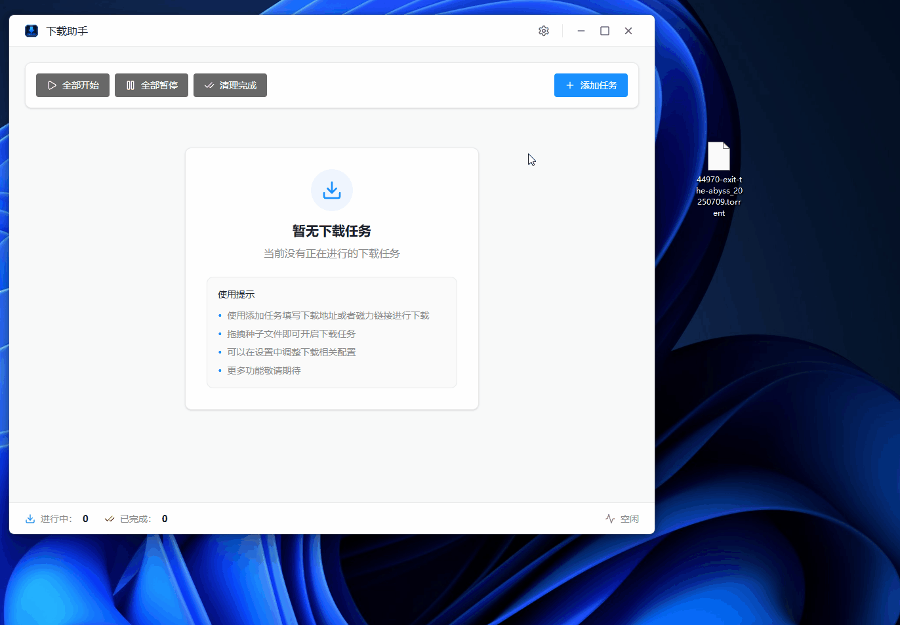

# DLApp - 轻量级下载工具
[下载程序](https://s.lixxix.com/api/v1/packages/download/下载助手_0.1.0_x64_zh-CN.msi)

一个功能强大、轻量级的下载管理工具，支持多种下载方式。


## 功能特性

- 🌐 **多协议支持** - 支持URL、种子（Torrent）和磁力链接（Magnet）下载
- ⚡ **高效下载** - 基于开源程序 aria2c，提供稳定高效的下载能力
- 💻 **轻量应用** - 资源占用少，运行流畅
- 📊 **下载管理** - 直观的下载任务管理界面

## 技术栈

- **前端框架**: React + TypeScript + Vite
- **桌面框架**: Tauri（轻量级跨平台解决方案）
- **下载引擎**: aria2c
- **UI组件库**: 自定义UI组件库（基于shadcn/ui风格）

## 项目结构

```
dlapp/
├── src/                    # 前端代码
│   ├── components/         # React组件
│   ├── pages/              # 页面组件
│   ├── contexts/           # React Context
│   ├── store/              # 状态管理
│   └── lib/                # 工具函数
├── src-tauri/              # Tauri后端代码
│   └── src/
│       ├── aria2c/         # aria2c集成模块
│       ├── config/         # 配置管理
│       └── main.rs         # 入口文件
└── package.json            # 项目依赖配置
```

## 快速开始

### 前置要求

- Node.js 16+
- Rust 1.56+（用于编译Tauri）

### 安装依赖

```bash
npm install
```

### 开发模式

```bash
npm run tauri dev
```

### 构建应用

```bash
npm run tauri build
```

## 主要模块说明

### aria2c 集成模块
项目集成了开源下载工具 aria2c，实现了核心的下载功能，包括：
- 下载命令管理
- 下载任务监控
- 多协议支持

### 前端界面
提供用户友好的下载管理界面，支持：
- 添加下载任务
- 查看下载进度
- 管理下载队列
- 设置和配置

## 许可证

MIT

## 贡献

欢迎提交 Issue 和 Pull Request！
